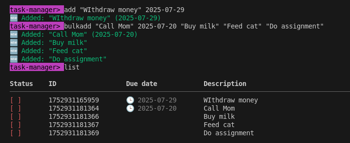
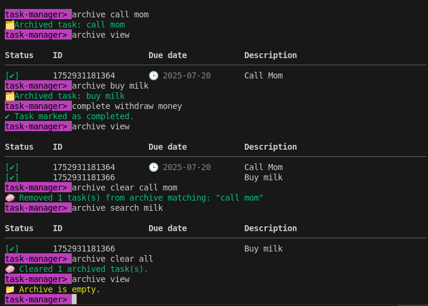

# ✨ Task Manager CLI

Welcome to the **Task Manager CLI** — your fast, flexible, and fabulous companion for managing tasks with flair. This isn’t your average command-line tool. It’s efficient, expressive, and smart enough to ignore your capitalization quirks. Yes, you heard that right — _**no need to care for case, the system will do its magics.**_ 🎩✨

## 🚀 Features That Make Life Easier

- ✅ Add and organize tasks with optional due dates
- ✅ Complete, delete, and archive tasks smoothly
- ✅ Bulk add tasks with paired due dates in one go
- ✅ View, search, and clear archived history
- ✅ Intelligent duplicate detection (we skip what you already did)
- ✅ Terminal auto-clean for minimalists
- ✅ And yes... **help is built in**

## 🧭 Usage Cheatsheet
Here’s your trusty command guide. Use these inside the mini-terminal after launching `task-manager`.

### 📌 Core Commands
```bash
add "<description>" <due-date>       # Add a single task
bulkadd <desc1> <due1> <desc2> <due2> ...  # Add multiple tasks at once
list                                  # View all active tasks
complete <description>                # Mark a task as completed
delete <description>                  # Delete a task from active list
```

### 📁 Archive Commands
```bash
archive <description>                 # Move a completed task to archive
archive view                          # Display archived tasks
archive search <keyword>             # Search archived tasks by keyword
archive clear all                    # Wipe the entire archive clean
archive clear <description>          # Delete specific archived task
```

### 🧼 Utility Commands
```bash
clear                                 # Clear the screen (just visuals, not your soul)
help                                  # View this magical guide
exit                                  # Leave the CLI gracefully
```

💡 *Don’t worry about typing "Call mom" or "call MOM" — it all works. We read the vibes, not just the bytes.*

## 💎 Smart Task Handling

- ✨ **Duplicate detection**: Adding a task with the same description and due date? The system will skip it and whisper: `"Call mom" (2025-08-01) already exists.`
- ✨ **Bulkadd bonus**: Adds every task except duplicates and shows skipped ones.
- ✨ **Whitespace forgiveness**: Leading/trailing spaces? Unwanted quotes? We clean up after you, quietly.

## 🔨 Tech Specs

- Built with **Node.js** and `readline` for terminal interaction
- Uses `colors` for fancy output
- Task data stored in `tasks.json` with structure:
```json
{
  "active": [],
  "archived": []
}
```

## 👀 Example Session

```bash
task-manager> bulkadd "Buy milk" 2025-07-20 "Call Mom" 2025-07-21 "Buy milk" 2025-07-20
🆕 Added: "Buy milk" (2025-07-20)
🆕 Added: "Call Mom" (2025-07-21)
⚠️ "Buy milk" (2025-07-20) already exists. Skipped.
```

## 📦 Data Storage

Tasks are stored in JSON. You can peek inside, but no need to manually edit — the CLI’s got everything under control.

## 🔧 Requirements & Setup

Before launching the Task Manager CLI, make sure you’ve got the following ready to roll:

### 🧪 Prerequisites
- [Node.js](https://nodejs.org/) (version **16.x** or higher)
- Git (optional, for cloning the project)
- Terminal access (Command Prompt, Bash, Zsh, etc.)

## 🚀 Installation Steps

### 1. 🧬 Clone the Repository
```bash
git clone https://github.com/your-username/task-manager-cli.git
cd task-manager-cli
```

Or download the ZIP manually and extract it to your preferred folder.
### 2. 📦 Install Dependencies
Run this from inside the project directory:
```bash
npm install
```

> This grabs all required packages like `colors`, and sets up your CLI environment.

### 3. 🔥 Start the Task Manager CLI
```bash
node app.js
```

Boom — your ASCII splash screen, help guide, and prompt will appear.
```plaintext
✨ Welcome to Task Manager CLI ✨
task-manager>
```

You’re now fully interactive. The magic awaits 💫
## 🧙 Getting Started
Once inside the CLI, try commands like:
```bash
add "Study for finals" 2025-07-22
bulkadd "Buy snacks" 2025-07-23 "Sleep early" 2025-07-24
list
archive "Study for finals"
archive view
```



To clear the screen and reorient:
```bash
clear
```

To get help:
```bash
help
…and the CLI will kindly walk you through every option like a loyal friend. Or an unpaid intern with excellent manners.
```

To leave the CLI peacefully:
```bash
exit
```
## 🙌 Contributing

Found a quirk or want to improve the command suite? Fork it, polish it, and let the task-manager shine brighter.

Made with ❤️, sarcasm, and fewer keystrokes than a spreadsheet.

